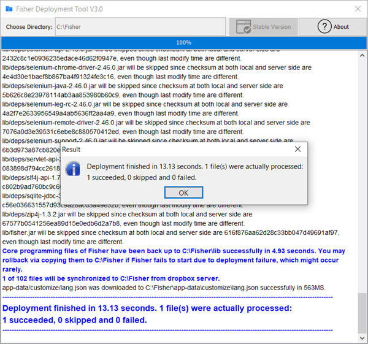
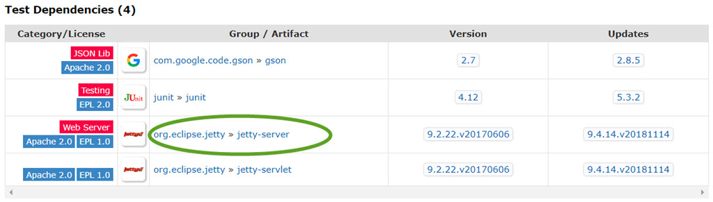
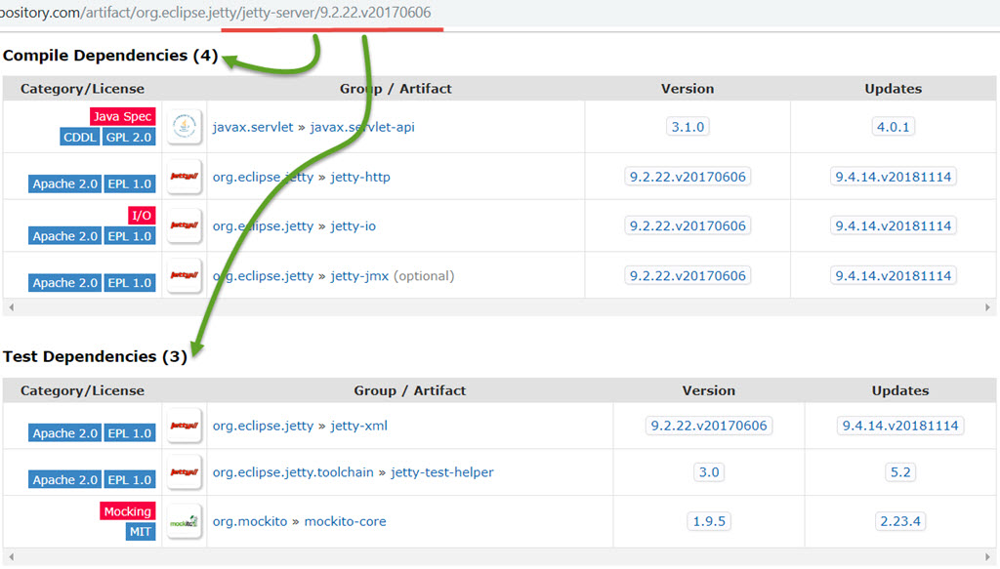

## Advanced Exercise Projects

### Motivation

These exercise projects are designed for students with other programming language experience already.
While beginners still need to get familiar with basic stuff, these students would get boring and waste
time, as a result, they are suggested to resolve some relatively complex exercises to improve their Java
programming skills. These projects are ordered by their difficulties or workload, from easy to hard or from
little too much, some project is not difficult but require more work, organize your classes well would be
more important than implementing a brain-hurt algorithm.

It is recommended to use [Maven](https://maven.apache.org/) to manage dependencies and project lifecycle management.
You may watch the [tutorial video](https://www.youtube.com/watch?v=pt3uB0sd5kY) from IDEA first if you never use Maven before.

### Project 1: Deploy Man
* You may generate an access token to simplify your development for your own account following this 
[post](https://blogs.dropbox.com/developers/2014/05/generate-an-access-token-for-your-own-account/)
* You can upload files to dropbox folder either manually or programmatically first 
* You just need to download files in Dropbox folder to a local directory
* _(Optional)_: When dropbox folder changed, it would better that you just download those changed files
if a full download was performed already
* You would need to setup Dropbox SDK first following the [instruction](https://github.com/dropbox/dropbox-sdk-java#setup)
* It will be better if you can provide a simple UI for end users


### Project 2: Maven Dependencies Traverser
If you introduce Jsoup to your dependencies you would probably access the
[url](https://mvnrepository.com/artifact/org.jsoup/jsoup/1.11.3) in mvnrepository already. 
Looking to its [POM](http://central.maven.org/maven2/org/jsoup/jsoup/1.11.3/jsoup-1.11.3.pom) you can find the
dependent libraries that Jsoup use.

Your task is to analyze the POM and list all dependent libraries Jsoup use and download the jar files and source
files(if available) to a local directory `%USERPROFILE%/.m2-jns`. Make sure you traverse to the end as the
first level dependencies also have their own dependencies. For example, Jsoup has test dependency of `jetty-server`:

  

And `jetty-server` also has bunches of dependencies like this:



PS: If you execute command `mvn dependency:tree` under [Jsoup](https://github.com/jhy/jsoup) after you cloned it.
You would probably get output like this:
```xml
org.jsoup:jsoup:jar:1.12.1-SNAPSHOT
+- junit:junit:jar:4.12:test
|  \- org.hamcrest:hamcrest-core:jar:1.3:test
+- com.google.code.gson:gson:jar:2.7:test
+- org.eclipse.jetty:jetty-server:jar:9.2.26.v20180806:test
|  +- javax.servlet:javax.servlet-api:jar:3.1.0:test
|  +- org.eclipse.jetty:jetty-http:jar:9.2.26.v20180806:test
|  |  \- org.eclipse.jetty:jetty-util:jar:9.2.26.v20180806:test
|  \- org.eclipse.jetty:jetty-io:jar:9.2.26.v20180806:test
\- org.eclipse.jetty:jetty-servlet:jar:9.2.26.v20180806:test
   \- org.eclipse.jetty:jetty-security:jar:9.2.26.v20180806:test
```

Jsoup itself provides simple but sufficient XML parse feature for this task, you may use its API to reduce the workload
of XML parsing and traversing. Below is a code snippet for your reference:
```java
String url = "http://central.maven.org/maven2/org/jsoup/jsoup/1.11.3/jsoup-1.11.3.pom";
Document doc = Jsoup.connect(url).get();
Elements dependencies = doc.select("dependencies > dependency");
dependencies.forEach(e -> {
    System.out.println(String.format("%s:%s:%s%s", e.select("groupId").text(),
        e.select("artifactId").text(), e.select("version").text(),
        e.select("scope").text().equals("test") ? ":test" : ""));
});
```

However, for a production-ready level solution, you may checkout
[maven-dependency-plugin](https://github.com/apache/maven-dependency-plugin) and review its implementation.

### Project 3: A Simple JSON Parser
You task consists of two parts:
* Serialize a Java object to JSON string, for example:
    ```java
    Person person = new Person("Tom Yang", 11, Gender.MALE);
    String json = JSON.serialize(person);
    // It would out put string like this(in pretty format):
    {
        "name": "Tom Yang",
        "age": 11,
        "gender": "MALE"
    }
    ```
* Parsing JSON string to Java object, for example:
    ```java
    // We explicitly declare we want an instance of class "Person"
    Person person = JSON.parse("{\"name\":\"Tom Yang\",\"age\":11,\"gender\":\"MALE\"}", Person.class);
    ```
* You may refer to [json.org](https://www.json.org/) for more about JSON specification
* Since this is a exercise project, you can keep it as simple as possible. There is no need to add fancy features.
[minimal-json](https://github.com/ralfstx/minimal-json) would be a proper example on project scale
* You may research the Top 5 JSON libraries in Java world to learn more. Among them
[fastjson](https://github.com/alibaba/fastjson) contributed by Alibaba was widely used in my projects

### Project 4: Mini OrderMan
As an Amazon drop-shipper, you need to spend numerous hours in finding profitable suppliers and fulfill the order
yourself. You are the person who can make a difference for them, and your tasks are described in the below:
* Your end user are basically rookies and know little or nothing about cmd, terminal, programming, so you must
provide them user-friendly, easy to use interface to finish their daily work effectively. As your customers care
about efficiency most, it's not required but good to have a beautiful, fancy interface
* Supplier Hunter: given an Amazon source listing, you need to find the most profitable supplier based on certain
criteria, which I will talk in details in classes
* Customer Service: if unfortunately you cannot find any profitable supplier and you choose to notify the customer
about this situation, please send bulk emails to related customers in time
* Order Fulfill Automation: fulfill the order based on the suppliers you've found automatically. Pay attention to
cases that the supplier disappears, or its prices rise too much, or its shipping too slow, or other bad cases.
Handle these scenarios in a reasonable way and generate an informative fulfill report so that the end user can interact
at lowest cost
* You may find Jsoup, HttpClient, Selenium, JXBrowser useful in certain scenarios

### Project 5: Mini MailMan
As a Customer Service Agent, it's somewhat boring to reply to certain kind of emails from the customer, for example,
sometimes customers just want to know their shipping status if due to many reasons a tracking number is not
uploaded in time or just impossible. In that case, you just need to fetch the tracking information and build
an email based on best practice templates then sends to customers automatically.

As there are nearly hundreds of carriers as shipping vendors, you need to support all these carriers and retrieve
the tracking information correctly.

This is an extracted, simplified project from real business dependent solution. More details will be given in classes.
After implementing this project, you will be able to take over the maintenance work.